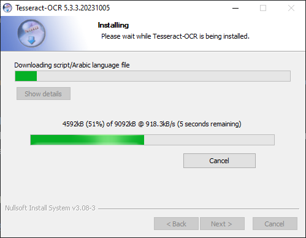
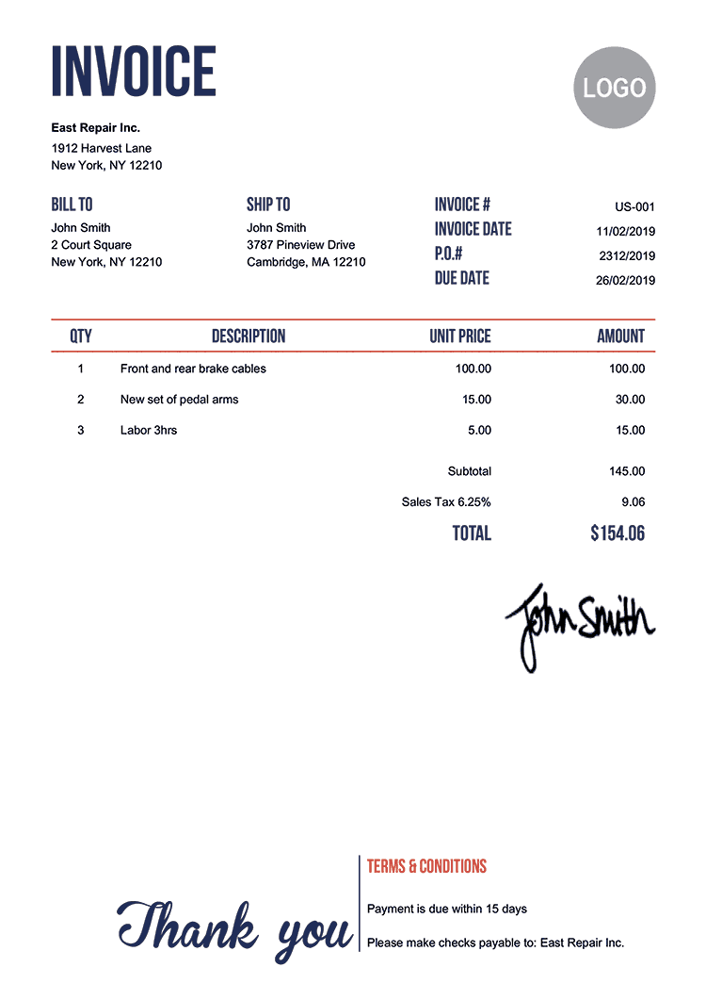

# headline: 使用 pipeline 进行推理


```python
from transformers import pipeline

transcriber = pipeline(task="automatic-speech-recognition")
```

    No model was supplied, defaulted to facebook/wav2vec2-base-960h and revision 55bb623 (https://huggingface.co/facebook/wav2vec2-base-960h).
    Using a pipeline without specifying a model name and revision in production is not recommended.
    
    ...
    
    Feature extractor Wav2Vec2FeatureExtractor {
      "do_normalize": true,
      "feature_extractor_type": "Wav2Vec2FeatureExtractor",
      "feature_size": 1,
      "padding_side": "right",
      "padding_value": 0.0,
      "return_attention_mask": false,
      "sampling_rate": 16000
    }
    
    


```python
transcriber(
    "https://huggingface.co/datasets/Narsil/asr_dummy/resolve/main/mlk.flac")
```

    ---------------------------------------------------------------------------

    FileNotFoundError                         Traceback (most recent call last)

    ...

    ValueError: ffmpeg was not found but is required to load audio files from filename


# 参数

> pipeline 支持许多参数，有些适用于特定任务，有些适用于所有 pipeline。通常在任何地方都可以指定对应参数


```python
transcriber = pipeline(model="openai/whisper-large-v2", my_parameter=1)
```

    loading configuration file config.json from cache at F:\Huggingface_cache\models--openai--whisper-large-v2\snapshots\ae4642769ce2ad8fc292556ccea8e901f1530655\config.json

      ...

    TypeError: AutomaticSpeechRecognitionPipeline._sanitize_parameters() got an unexpected keyword argument 'my_parameter'


# 在数据集上使用 pipeline


```python
# 定义一个迭代器函数
def data():
    for i in range(10):
        yield f"My example {i}"


# 用 pipeline 下载并生成一个预训练模型
pipe = pipeline(model='openai-community/gpt2', device=0)

generated_characters = 0

# 自动识别输入为可迭代对象，并在 GPU 上处理数据的同时开始获取数据（在底层使用 DataLoader）
for out in pipe(data()):
    generated_characters += len(out[0]['generated_text'])

generated_characters
```

    Setting `pad_token_id` to `eos_token_id`:50256 for open-end generation.

    ...

    1940


```python
pipe('My example 1')
```

    [{'generated_text': 'My example 1 will start with a simple graph, see the diagram here:\n\nNote as well of course that this function is called from any sort of thread. So, it does not actually send the data, but to a single thread to send'}]

> 迭代数据集最简单的方法是从 Datasets 上加载数据集


```python
from transformers.pipelines.pt_utils import KeyDataset
from transformers import pipeline
from datasets import load_dataset

pipe = pipeline(model='hf-internal-testing/tiny-random-wav2vec2', device=0)

dataset = load_dataset('hf-internal-testing/librispeech_asr_dummy',
                       'clean',
                       split='validation[:10]')

for out in pipe(KeyDataset(dataset=dataset, key='audio')):
    print(out)
```

    {'text': "EYB  ZB COE C BEZCYCZ HO MOWWB EM BWOB ZMEG  B COEB BE BEC B U OB BE BCB BEWUBB 
    ...
    
    BUCWSE EZ MZOSOECO ZY ZY SZB  B SBT T SB  XEGBMCBE B BEB BE B EBEB  ZE BEH  B B W EC USB E B 'B"}
    

# 视觉流水线

> 对于视觉任务，使用 pipeline() 几乎是相同的。指定任务并将图像传递给分类器，图像可以是链接、本地路径或者 base64 编码的图像。


```python
from transformers import pipeline

vision_classifier = pipeline(model="google/vit-base-patch16-224")

preds = vision_classifier(images="./pipeline-cat-chonk.jpeg")

preds = [{
    "score": round(pred["score"], 4),
    "label": pred["label"]
} for pred in preds]

preds
```

    [{'score': 0.4403, 'label': 'lynx, catamount'},
     {'score': 0.0343,
      'label': 'cougar, puma, catamount, mountain lion, painter, panther, Felis concolor'},
     {'score': 0.0321, 'label': 'snow leopard, ounce, Panthera uncia'},
     {'score': 0.0235, 'label': 'Egyptian cat'},
     {'score': 0.023, 'label': 'tiger cat'}]


# 文本流水线

> 对于 NLP（自然语言处理）任务，使用 pipeline() 几乎是相同的


```python
from transformers import pipeline

# This model is a `zero-shot-classification` model.
# It will classify text, except you are free to choose any label you might imagine
# 处理零文本输入的分类问题
classifier = pipeline('zero-shot-classification',
                      model='facebook/bart-large-mnli')

text = 'I have a problem with my iphone that needs to be resolved asap!!'

classifier(
    text,
    # urgent 紧急的，tablet 平板
    candidate_labels=["urgent", "not urgent", "phone", "tablet", "computer"])
```

    {'sequence': 'I have a problem with my iphone that needs to be resolved asap!!',
     'labels': ['urgent', 'phone', 'computer', 'not urgent', 'tablet'],
     'scores': [0.5036357045173645,
      0.47879961133003235,
      0.012600073590874672,
      0.0026557939127087593,
      0.002308752853423357]}


# 多模态流水线

> pipeline 支持多个模态。例如，视觉问题问答（VQA）任务结合了文本和图像。

> 提前安装 pytesseract

```
pip install pytesseract
```

> 本地安装 tesseract-ocr

> 从页面 https://github.com/UB-Mannheim/tesseract/wiki 下载基于 Windows 的 tesseract-ocr 的 exe 安装文件。当前安装的路径为 D:\Program Files\Tesseract-OCR，然后把这个路径 D:\Program Files\Tesseract-OCR 配置到环境变量中。继续将下面的包安装完成后，重启笔记本，运行下面的程序就不会出现错误提示。



> 安装 tesseract

```
pip install tesseract
```

> Python-tesseract is an optical character recognition (OCR) tool for python. That is, it will recognize and “read” the text embedded in images.




```python
from transformers import pipeline

vqa = pipeline(task='document-question-answering',
               model='impira/layoutlm-document-qa')

vqa(image='./invoice.png', question='What is the invoice number?')
```


    [{'score': 0.9998127222061157, 'answer': 'us-001', 'start': 15, 'end': 15}]


> 从输出的结果看到，模型根据问题（question），从图片里识别出了问题的答案 us-001，就是图片右上方的内容。

# 在大模型上使用🤗 accelerate 和 pipeline


```python
import torch
from transformers import pipeline

pipe = pipeline(model='facebook/opt-1.3b',torch_dtype=torch.bfloat16,device_map='auto')

output = pipe('This is a cool example', do_sample=True, top_p=0.95)

output
```

    [{'generated_text': 'This is a cool example of the use of 2x2 and 4x4 for a box/'}]


# Thanks