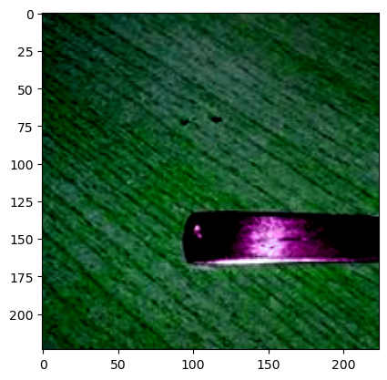

# headline: 预处理数据

> 在用数据训练模型之前，无论是文本、图像还是音频，都需要被转换并组合成批量的张量。Transformers 提供了一组预处理类来帮助对数据进行预处理。

* 文本：使用分词器 tokenizer 将文本转换为一系列标记（tokens），并创建 tokens 的数字表示，将它们组合成张量。

* 语音和音频：使用特征提取器（feature extractor）从音频波形中提取顺序特征，并将其转换为张量。

* 图像：使用图像处理器（ImageProcessor）将图像转换为张量。

* 多模态输入：使用处理器（Process）结合了 Tokenizer 和 ImageProcessor 或 Processor。

# 自然语言处理

> 处理文本数据的主要工具是 Tokenizer，它根据一组规则将文本拆分为 tokens，然后将这些 tokens 转换为数字，然后再转换为张量，最后输入到模型中。模型所需要的任何附加输入都由 Tokenizer 添加。

> 如果您计划使用预训练模型，重要的是使用与之关联的预训练Tokenizer。这确保文本的拆分方式与预训练语料库相同，并在预训练期间使用相同的标记-索引的对应关系（通常称为词汇表-vocab）

V: 这里的内容是需要 TTS 软件将当前的文本内容转换为语音朗读的结果。然后把这段朗读内容放入视频剪辑软件中与录屏视频联合编辑。

> 使用 AutoTokenizer.from_pretrained() 加载一个预训练 Tokenizer，这将下载模型预训练的 vocab


```python
from transformers import AutoTokenizer

tokenizer = AutoTokenizer.from_pretrained('google-bert/bert-base-cased')

tokenizer
```


    BertTokenizerFast(name_or_path='google-bert/bert-base-cased', vocab_size=28996, model_max_length=512, is_fast=True, padding_side='right', truncation_side='right', special_tokens={'unk_token': '[UNK]', 'sep_token': '[SEP]', 'pad_token': '[PAD]', 'cls_token': '[CLS]', 'mask_token': '[MASK]'}, clean_up_tokenization_spaces=True),  added_tokens_decoder={
    	0: AddedToken("[PAD]", rstrip=False, lstrip=False, single_word=False, normalized=False, special=True),
    	100: AddedToken("[UNK]", rstrip=False, lstrip=False, single_word=False, normalized=False, special=True),
    	101: AddedToken("[CLS]", rstrip=False, lstrip=False, single_word=False, normalized=False, special=True),
    	102: AddedToken("[SEP]", rstrip=False, lstrip=False, single_word=False, normalized=False, special=True),
    	103: AddedToken("[MASK]", rstrip=False, lstrip=False, single_word=False, normalized=False, special=True),
    }


> 将文本传递给 Tokenizer


```python
encoded_input = tokenizer(
    'Do not meddle in the affairs of wizards, for they are subtle and quick to anger.'
)

encoded_input
```


    {'input_ids': [101, 2091, 1136, 1143, 13002, 1107, 1103, 5707, 1104, 16678, 1116, 117, 1111, 1152, 1132, 11515, 1105, 3613, 1106, 4470, 119, 102], 'token_type_ids': [0, 0, 0, 0, 0, 0, 0, 0, 0, 0, 0, 0, 0, 0, 0, 0, 0, 0, 0, 0, 0, 0], 'attention_mask': [1, 1, 1, 1, 1, 1, 1, 1, 1, 1, 1, 1, 1, 1, 1, 1, 1, 1, 1, 1, 1, 1]}


* input_ids: 是与句子中每个 token 对应的索引。句子中的每个单词（或者子单词）在 vocab 里都会有记录，然后根据这个单词的记录找到索引值。比如单词 do 在 vocab 里的索引是 2091，那么就把这个 2091 返回出来，保存到 input_ids 的列表里面。
    
* attention_mask: 指示是否应该关注一个 token。如果对应位置上的值是 1，那就表示应该关注这个位置上的 token
    
* token_type_ids: 存在多个序列时，标识一个 token 属于哪个序列。它一般是个一维数组，按照不同的数字标识哪些 token 属于哪个序列。

> 通过解码 input_ids 返回编码后的文本内容


```python
tokenizer.decode(encoded_input['input_ids'])
```


    '[CLS] Do not meddle in the affairs of wizards, for they are subtle and quick to anger. [SEP]'


> 如果由多个句子需要处理，将它们放在列表里传递给 Tokenizer


```python
batch_sentences = [
    'But what about second breakfast?',
    "Don't think he knows about second breakfast, Pip.",
    'What about elevensies?'
]

encoded_input = tokenizer(batch_sentences)

encoded_input
```


    {'input_ids': [[101, 1252, 1184, 1164, 1248, 6462, 136, 102], [101, 1790, 112, 189, 1341, 1119, 3520, 1164, 1248, 6462, 117, 21902, 1643, 119, 102], [101, 1327, 1164, 5450, 23434, 136, 102]], 'token_type_ids': [[0, 0, 0, 0, 0, 0, 0, 0], [0, 0, 0, 0, 0, 0, 0, 0, 0, 0, 0, 0, 0, 0, 0], [0, 0, 0, 0, 0, 0, 0]], 'attention_mask': [[1, 1, 1, 1, 1, 1, 1, 1], [1, 1, 1, 1, 1, 1, 1, 1, 1, 1, 1, 1, 1, 1, 1], [1, 1, 1, 1, 1, 1, 1]]}


> 将 input_ids 解码出来


```python
print(tokenizer.decode(encoded_input['input_ids'][0]))
print(tokenizer.decode(encoded_input['input_ids'][1]))
print(tokenizer.decode(encoded_input['input_ids'][2]))
```

    [CLS] But what about second breakfast? [SEP]
    [CLS] Don't think he knows about second breakfast, Pip. [SEP]
    [CLS] What about elevensies? [SEP]


# 填充

> 句子的长度不会总是相同，但是模型输入的张量需要具有统一的形状，所以填充句子使其保持相同的长度是一种策略。通过在较短的句子中添加一个特殊的 padding token，以确保张量是矩阵形状的（每个句子转换成的 token 列表具有相同的形状）

> 将 Tokenizer 的构造方法里的 padding=True，使该批次中较短的序列填充到与最长序列相同的长度。


```python
batch_sentences = [
    'But what about second breakfast?',
    "Don't think he knows about second breakfast, Pip.",
    'What about elevensies?'
]

encoded_input = tokenizer(batch_sentences, padding=True)

encoded_input
```


    {'input_ids': [[101, 1252, 1184, 1164, 1248, 6462, 136, 102, 0, 0, 0, 0, 0, 0, 0], [101, 1790, 112, 189, 1341, 1119, 3520, 1164, 1248, 6462, 117, 21902, 1643, 119, 102], [101, 1327, 1164, 5450, 23434, 136, 102, 0, 0, 0, 0, 0, 0, 0, 0]], 'token_type_ids': [[0, 0, 0, 0, 0, 0, 0, 0, 0, 0, 0, 0, 0, 0, 0], [0, 0, 0, 0, 0, 0, 0, 0, 0, 0, 0, 0, 0, 0, 0], [0, 0, 0, 0, 0, 0, 0, 0, 0, 0, 0, 0, 0, 0, 0]], 'attention_mask': [[1, 1, 1, 1, 1, 1, 1, 1, 0, 0, 0, 0, 0, 0, 0], [1, 1, 1, 1, 1, 1, 1, 1, 1, 1, 1, 1, 1, 1, 1], [1, 1, 1, 1, 1, 1, 1, 0, 0, 0, 0, 0, 0, 0, 0]]}


> 第一句和第三句较短，默认在句子的右面（后面）用 0 进行填充。

# 截断

> 有时一个序列可能对于模型太长了，这种情况下需要将序列截断为较短的长度。

> 设置 Tokenizer 的参数 truncation=True，将序列截断为模型接收的最大长度。


```python
batch_sentences = [
    'But what about second breakfast?',
    "Don't think he knows about second breakfast, Pip.",
    'What about elevensies?'
]

encoded_input = tokenizer(batch_sentences, padding=True, truncation=True)

encoded_input
```


    {'input_ids': [[101, 1252, 1184, 1164, 1248, 6462, 136, 102, 0, 0, 0, 0, 0, 0, 0], [101, 1790, 112, 189, 1341, 1119, 3520, 1164, 1248, 6462, 117, 21902, 1643, 119, 102], [101, 1327, 1164, 5450, 23434, 136, 102, 0, 0, 0, 0, 0, 0, 0, 0]], 'token_type_ids': [[0, 0, 0, 0, 0, 0, 0, 0, 0, 0, 0, 0, 0, 0, 0], [0, 0, 0, 0, 0, 0, 0, 0, 0, 0, 0, 0, 0, 0, 0], [0, 0, 0, 0, 0, 0, 0, 0, 0, 0, 0, 0, 0, 0, 0]], 'attention_mask': [[1, 1, 1, 1, 1, 1, 1, 1, 0, 0, 0, 0, 0, 0, 0], [1, 1, 1, 1, 1, 1, 1, 1, 1, 1, 1, 1, 1, 1, 1], [1, 1, 1, 1, 1, 1, 1, 0, 0, 0, 0, 0, 0, 0, 0]]}


# 构建张量

> Tokenizer 可以返回实际输入到模型的张量

> 在 Tokenizer 里设置 return_tensors 为 pt（针对 PyTorch）或者 tf（针对 TensorFlow）


```python
batch_sentences = [
    'But what about second breakfast?',
    "Don't think he knows about second breakfast, Pip.",
    'What about elevensies?'
]

encoded_input = tokenizer(batch_sentences,
                          padding=True,
                          truncation=True,
                          return_tensors='pt')

encoded_input
```


    {'input_ids': tensor([[  101,  1252,  1184,  1164,  1248,  6462,   136,   102,     0,     0,
                 0,     0,     0,     0,     0],
            [  101,  1790,   112,   189,  1341,  1119,  3520,  1164,  1248,  6462,
               117, 21902,  1643,   119,   102],
            [  101,  1327,  1164,  5450, 23434,   136,   102,     0,     0,     0,
                 0,     0,     0,     0,     0]]), 'token_type_ids': tensor([[0, 0, 0, 0, 0, 0, 0, 0, 0, 0, 0, 0, 0, 0, 0],
            [0, 0, 0, 0, 0, 0, 0, 0, 0, 0, 0, 0, 0, 0, 0],
            [0, 0, 0, 0, 0, 0, 0, 0, 0, 0, 0, 0, 0, 0, 0]]), 'attention_mask': tensor([[1, 1, 1, 1, 1, 1, 1, 1, 0, 0, 0, 0, 0, 0, 0],
            [1, 1, 1, 1, 1, 1, 1, 1, 1, 1, 1, 1, 1, 1, 1],
            [1, 1, 1, 1, 1, 1, 1, 0, 0, 0, 0, 0, 0, 0, 0]])}


> 返回的数据类型是 tensor 类型的对象。

# 音频

> 对于音频任务，需要 feature extractor 来预处理数据集以供模型使用。feature extractor 旨在从原始音频数据中提取特征，并将它们转换为张量。


```python
from datasets import load_dataset

# 加载 MinDS-14 数据集
dataset = load_dataset('PolyAI/minds14', name='en-US', split='train')

dataset
```

    d:\anaconda3\Lib\site-packages\datasets\load.py:1429: FutureWarning: The repository for PolyAI/minds14 contains custom code which must be executed to correctly load the dataset. You can inspect the repository content at https://hf.co/datasets/PolyAI/minds14
    You can avoid this message in future by passing the argument `trust_remote_code=True`.
    Passing `trust_remote_code=True` will be mandatory to load this dataset from the next major release of `datasets`.
      warnings.warn(


    Dataset({
        features: ['path', 'audio', 'transcription', 'english_transcription', 'intent_class', 'lang_id'],
        num_rows: 563
    })


> 访问数据集的第一个元素的 audio 列，调用 audio 列会自动加载和重新采样音频文件


```python
dataset[0]['audio']
```


    {'path': 'F:\\Huggingface_datasets\\downloads\\extracted\\aee57c9b6ba30a70f17f4bf15b74e675e52f0e9439ed4e44f29c2c3abc4f718e\\en-US~JOINT_ACCOUNT\\602ba55abb1e6d0fbce92065.wav',
     'array': array([ 0.        ,  0.00024414, -0.00024414, ..., -0.00024414,
             0.        ,  0.        ]),
     'sampling_rate': 8000}


> 返回三个对象：

* array: 加载的语音信号，并在必要时重新采样为 1D array
* path: 指向音频文件的路径
* sampling_rate: 每秒测量的语音信号数据点数量。这里显示的采样率是 8kHz
    
> 对于本教程，将采用 Wav2Vec2 模型，查看模型的卡片会了解到该模型是在 16kHz 采样的语音音频数据上预训练的。所以你的音频数据的采样率要与用于预训练模型的数据集的采样率一致，如果你的数据的采样率不同，那就需要对数据进行重新采样。

> 用 Datasets 的 cast_column 方法将采样率提升到 16kHz


```python
from datasets import Audio

# 修改原始数据集的采样率
dataset = dataset.cast_column('audio', Audio(sampling_rate=16_000))

# 再次查看 audio 列查看采样率是否有所变化（对应的音频的数据也会有所变化）
dataset[0]['audio']
```


    {'path': 'F:\\Huggingface_datasets\\downloads\\extracted\\aee57c9b6ba30a70f17f4bf15b74e675e52f0e9439ed4e44f29c2c3abc4f718e\\en-US~JOINT_ACCOUNT\\602ba55abb1e6d0fbce92065.wav',
     'array': array([ 1.70561689e-05,  2.18727393e-04,  2.28099860e-04, ...,
             3.43842403e-05, -5.96366226e-06, -1.76846370e-05]),
     'sampling_rate': 16000}


> 导入 AutoFeatureExtractor 类，对输入的音频数据进行标准化和填充。当填充音频转换到的文本数据时，会为较短的序列添加 0，feature extractor 添加 0 被解释为静音


```python
from transformers import AutoFeatureExtractor

feature_extractor = AutoFeatureExtractor.from_pretrained(
    'facebook/wav2vec2-base')

feature_extractor
```

    d:\anaconda3\Lib\site-packages\transformers\configuration_utils.py:387: UserWarning: Passing `gradient_checkpointing` to a config initialization is deprecated and will be removed in v5 Transformers. Using `model.gradient_checkpointing_enable()` instead, or if you are using the `Trainer` API, pass `gradient_checkpointing=True` in your `TrainingArguments`.
      warnings.warn(


    Wav2Vec2FeatureExtractor {
      "do_normalize": true,
      "feature_extractor_type": "Wav2Vec2FeatureExtractor",
      "feature_size": 1,
      "padding_side": "right",
      "padding_value": 0.0,
      "return_attention_mask": false,
      "sampling_rate": 16000
    }


> 将音频列表传递给 feature extractor，尽量在里面添加属性 sampling_rate 参数为 16000，以便更好的调试可能发生的静音错误。


```python
audio_input = [dataset[0]['audio']['array']]

feature_extractor(audio_input, sampling_rate=16_000)
```


    {'input_values': [array([ 3.0293188e-04,  2.7676329e-03,  2.8821772e-03, ...,
            5.1470485e-04,  2.1597749e-05, -1.2164875e-04], dtype=float32)]}


```python
print(dataset[0]['audio']['array'].shape)
print(dataset[1]['audio']['array'].shape)
```

    (173398,)
    (106496,)


> 看到数据集里的不同样本的长度不同，可以使用填充或者截断使其长度一致，最终形成数据的矩阵。

> 创建一个函数来处理数据集，是音频样本具有相同的长度。通过指定最大样本长度，feature extractor 将填充或截断序列使其长度一致


```python
def preprocess_function(example):
    audio_arrays = [x['array'] for x in example['audio']]
    inputs = feature_extractor(audio_arrays,
                               sampling_rate=16_000,
                               padding=True,
                               max_length=100000,
                               truncation=True)
    return inputs
```

> 将上面定义的预处理函数应用到数据集的前几个样本


```python
processed_dataset = preprocess_function(dataset[:5])
processed_dataset
```


    {'input_values': [array([ 0.0003766 ,  0.00283419,  0.0029484 , ..., -0.0006577 ,
            0.00274966,  0.0046367 ], dtype=float32), array([9.8648743e-05, 3.7331975e-03, 6.9454317e-03, ..., 1.3289673e-02,
           1.8929781e-02, 1.9546991e-02], dtype=float32), array([ 2.2214508e-04,  5.0335459e-04,  2.9261783e-04, ...,
           -2.6318517e+00, -2.1792681e+00, -1.7696079e+00], dtype=float32), array([ 2.81037553e-03,  1.90750789e-03,  2.78295396e-04, ...,
           -1.37018105e-05, -1.37018105e-05, -1.37018105e-05], dtype=float32), array([-2.2644838e-03, -1.0359620e-03,  4.2158877e-06, ...,
            1.3075768e-05,  1.3075768e-05,  1.3075768e-05], dtype=float32)]}


> 再查看处理后的结果，查看数据的长度是否一致


```python
print(processed_dataset['input_values'][0].shape)
print(processed_dataset['input_values'][1].shape)
print(processed_dataset['input_values'][2].shape)
print(processed_dataset['input_values'][3].shape)
print(processed_dataset['input_values'][4].shape)
```

    (100000,)
    (100000,)
    (100000,)
    (100000,)
    (100000,)


# 计算机视觉

> 对于计算机视觉任务，您需要一个image processor来准备数据集以供模型使用。图像预处理包括多个步骤将图像转换为模型期望输入的格式。这些步骤包括但不限于调整大小、标准化、颜色通道校正以及将图像转换为张量。

> 图像预处理通常遵循某种形式的图像增强。图像预处理和图像增强都会改变图像数据，但它们有不同的目的：

* 图像增强可以帮助防止过拟合并增加模型的鲁棒性。您可以在数据增强方面充分发挥创造性 - 调整亮度和颜色、裁剪、旋转、调整大小、缩放等。但要注意不要改变图像的含义。

* 图像预处理确保图像与模型预期的输入格式匹配。在微调计算机视觉模型时，必须对图像进行与模型训练时相同的预处理

> 加载 food101 数据集。因为这个数据集相当大，如果有必要可以只加载少量样本。


```python
from datasets import load_dataset

# dataset = load_dataset('food101', split='train[:100]')
dataset = load_dataset('food101')

dataset
```


    DatasetDict({
        train: Dataset({
            features: ['image', 'label'],
            num_rows: 75750
        })
        validation: Dataset({
            features: ['image', 'label'],
            num_rows: 25250
        })
    })


```python
dataset['train'][0]['image']
```


    

    


> 使用 AutoImageProcessor.from_pretrained() 生成图像处理器


```python
from transformers import AutoImageProcessor

image_processor = AutoImageProcessor.from_pretrained(
    'google/vit-base-patch16-224')

image_processor
```


    ViTImageProcessor {
      "do_normalize": true,
      "do_rescale": true,
      "do_resize": true,
      "image_mean": [
        0.5,
        0.5,
        0.5
      ],
      "image_processor_type": "ViTImageProcessor",
      "image_std": [
        0.5,
        0.5,
        0.5
      ],
      "resample": 2,
      "rescale_factor": 0.00392156862745098,
      "size": {
        "height": 224,
        "width": 224
      }
    }


> 进行图像增强处理

> 在这里，我们使用Compose将RandomResizedCrop和 ColorJitter变换连接在一起。请注意，对于调整大小，我们可以从image_processor中获取图像尺寸要求。对于一些模型，精确的高度和宽度需要被定义，对于其他模型只需定义shortest_edge。


```python
from torchvision.transforms import RandomResizedCrop, ColorJitter, Compose

# 计算图像的最小尺寸
size = (image_processor.size['shortest_edge']
        if 'shortest_edge' in image_processor.size else
        (image_processor.size['height'], image_processor.size['width']))

size
```


    (224, 224)


```python
# 将最小尺寸的值传入函数 RandomResizedCrop() 函数中，随机第一些图像的尺寸进行调整
# 还通过 ColorJitter() 对图像的亮度和色调进行了调整（赋值 0.5）
_transforms = Compose(
    [RandomResizedCrop(size),
     ColorJitter(brightness=0.5, hue=0.5)])

# 最后生成一个图像转换器对象
_transforms
```


    Compose(
        RandomResizedCrop(size=(224, 224), scale=(0.08, 1.0), ratio=(0.75, 1.3333), interpolation=bilinear, antialias=warn)
        ColorJitter(brightness=(0.5, 1.5), contrast=None, saturation=None, hue=(-0.5, 0.5))
    )


> 图像接受 pixel_values 作为输入，ImageProcessor 可以进行图像的标准化，并生成适当的张量。

> 下面创建一个函数，将图像增强和图像预处理步骤组合起来处理批量的图像，并生成 pixel_values


```python
def transforms(examples):
    # 遍历图像样本，图像增强
    images = [_transforms(img.convert('RGB')) for img in examples['image']]
    examples['pixel_values'] = image_processor(
        images=images, do_resize=False, return_tensors='pt')['pixel_values']
    return examples
```

> 设置 do_resize=False，因为已经在第一步的图像增强中调整了图像的大小（224, 224）。如果在图像增强期间不调整图像的大小，那么在上面的 _transforms 的定义部分去掉 RandomResizedCrop(size) 这部分代码。

> 使用 Datasets 的 set_transform 在运行时应用这些变换


```python
dataset.set_transform(transform=transforms)
```

    Parameter 'transform'=<function transforms at 0x00000207221BF560> of the transform datasets.arrow_dataset.Dataset.set_format couldn't be hashed properly, a random hash was used instead. Make sure your transforms and parameters are serializable with pickle or dill for the dataset fingerprinting and caching to work. If you reuse this transform, the caching mechanism will consider it to be different from the previous calls and recompute everything. This warning is only showed once. Subsequent hashing failures won't be showed.


> 现在访问图像数据时，会看到添加了一个 pixel_values 属性


```python
dataset['train'][0].keys()
```


    dict_keys(['image', 'label', 'pixel_values'])


```python
dataset['train'][0]
```


    {'image': <PIL.JpegImagePlugin.JpegImageFile image mode=RGB size=384x512>,
     'label': 6,
     'pixel_values': tensor([[[-0.8745, -0.8588, -0.8510,  ..., -0.9451, -0.7098, -0.6235],
              [-0.8745, -0.8824, -0.8824,  ..., -0.6471, -0.4118, -0.2706],
              [-0.8588, -0.8667, -0.8667,  ..., -0.3490, -0.3804, -0.3569],
              ...,
              [-0.4902, -0.5059, -0.4745,  ..., -0.2078, -0.2157, -0.1843],
              [-0.4588, -0.5294, -0.5686,  ..., -0.1765, -0.1922, -0.1529],
              [-0.4667, -0.5059, -0.5373,  ..., -0.1922, -0.2157, -0.1843]],
     
             [[-0.8667, -0.8510, -0.8431,  ..., -0.7020, -0.4745, -0.4039],
              [-0.8667, -0.8745, -0.8745,  ..., -0.4510, -0.2235, -0.0902],
              [-0.8510, -0.8588, -0.8588,  ..., -0.1922, -0.2392, -0.2157],
              ...,
              [-0.5373, -0.5451, -0.5059,  ..., -0.2471, -0.2627, -0.2235],
              [-0.4980, -0.5765, -0.6078,  ..., -0.2157, -0.2314, -0.1922],
              [-0.5059, -0.5451, -0.5765,  ..., -0.2314, -0.2549, -0.2235]],
     
             [[-0.8980, -0.8902, -0.8824,  ..., -0.7255, -0.5059, -0.4431],
              [-0.8980, -0.9137, -0.9137,  ..., -0.4824, -0.2706, -0.1294],
              [-0.8902, -0.8980, -0.8980,  ..., -0.2314, -0.2706, -0.2627],
              ...,
              [-0.6235, -0.6314, -0.5922,  ..., -0.3725, -0.3804, -0.3490],
              [-0.6000, -0.6627, -0.6863,  ..., -0.3412, -0.3490, -0.3176],
              [-0.6078, -0.6392, -0.6627,  ..., -0.3490, -0.3725, -0.3490]]])}


> 查看处理后的图像的效果


```python
import numpy as np
import matplotlib.pyplot as plt

img = dataset['train'][0]['pixel_values']
plt.imshow(img.permute(1, 2, 0))
```

    Clipping input data to the valid range for imshow with RGB data ([0..1] for floats or [0..255] for integers).


    <matplotlib.image.AxesImage at 0x2073f78a550>


    

    


> 现在的图像数据就算是处理过的数据了，可以传递给模型了

# 填充

> 比如在微调模型时，模型在训练时应用了尺度增强，这可能导致批处理中的图像大小不同。可以使用 DetrImageProcessor.pad() 来指定自定义的 collate_fn 将图像批处理在一起


```python
def collate_fn(batch):
    pixel_values = [item['pixel_values'] for item in batch]
    encoding = image_processor.pad(pixel_values, return_tensors='pt')
    labels = [item['labels'] for item in batch]
    batch = {}
    batch['pixel_values'] = encoding['pixel_values']
    batch['pixel_mask'] = encoding['pixel_mask']
    batch['labels'] = labels
    return batch
```

> ??? 怎么使用这个处理函数对数据集进行处理

# 多模态

> 加载 LJ Speech 数据集，以了解如何使用 processor 进行自动语言识别（ASR）


```python
from datasets import load_dataset

lj_speech = load_dataset('lj_speech')

lj_speech
```


    Downloading data:   0%|          | 0.00/528M [00:00<?, ?B/s]


    Downloading data:   0%|          | 0.00/523M [00:00<?, ?B/s]


    Downloading data:   0%|          | 0.00/517M [00:00<?, ?B/s]


    Downloading data:   0%|          | 0.00/516M [00:00<?, ?B/s]


    Downloading data:   0%|          | 0.00/507M [00:00<?, ?B/s]


    Downloading data:   0%|          | 0.00/516M [00:00<?, ?B/s]


    Downloading data:   0%|          | 0.00/505M [00:00<?, ?B/s]


    Downloading data:   0%|          | 0.00/175M [00:00<?, ?B/s]


    Generating train split: 0 examples [00:00, ? examples/s]


    DatasetDict({
        train: Dataset({
            features: ['id', 'audio', 'file', 'text', 'normalized_text'],
            num_rows: 13100
        })
    })


> 对于 ASR，主要关注 audio 和 text，所以可以删除其他列


```python
lj_speech = lj_speech.map(remove_columns=['file', 'id', 'normalized_text'])

lj_speech
```


    Map:   0%|          | 0/13100 [00:00<?, ? examples/s]


    DatasetDict({
        train: Dataset({
            features: ['audio', 'text'],
            num_rows: 13100
        })
    })


> 查看 audio 和 text 列


```python
lj_speech['train'][0]['audio']
```


    {'path': 'LJ001-0001.wav',
     'array': array([-7.32421875e-04, -7.62939453e-04, -6.40869141e-04, ...,
             7.32421875e-04,  2.13623047e-04,  6.10351562e-05]),
     'sampling_rate': 22050}


```python
lj_speech['train'][0]['text']
```


    'Printing, in the only sense with which we are at present concerned, differs from most if not from all the arts and crafts represented in the Exhibition'


```python
lj_speech['train'][0]
```


    {'audio': {'path': 'LJ001-0001.wav',
      'array': array([-7.32421875e-04, -7.62939453e-04, -6.40869141e-04, ...,
              7.32421875e-04,  2.13623047e-04,  6.10351562e-05]),
      'sampling_rate': 22050},
     'text': 'Printing, in the only sense with which we are at present concerned, differs from most if not from all the arts and crafts represented in the Exhibition'}


> 始终重新定义音频数据集的采样率，以匹配用于预训练模型的采样率


```python
lj_speech = lj_speech.cast_column('audio', Audio(sampling_rate=16000))
```


```python
lj_speech['train'][0]['audio']['sampling_rate']
```


    16000


> 使用 AutoProcessor.from_pretrained() 加载一个 processor


```python
from transformers import AutoProcessor

processor = AutoProcessor.from_pretrained('facebook/wav2vec2-base-960h')

processor
```


    Wav2Vec2Processor:
    - feature_extractor: Wav2Vec2FeatureExtractor {
      "do_normalize": true,
      "feature_extractor_type": "Wav2Vec2FeatureExtractor",
      "feature_size": 1,
      "padding_side": "right",
      "padding_value": 0.0,
      "return_attention_mask": false,
      "sampling_rate": 16000
    }
    
    - tokenizer: Wav2Vec2CTCTokenizer(name_or_path='facebook/wav2vec2-base-960h', vocab_size=32, model_max_length=9223372036854775807, is_fast=False, padding_side='right', truncation_side='right', special_tokens={'bos_token': '<s>', 'eos_token': '</s>', 'unk_token': '<unk>', 'pad_token': '<pad>'}, clean_up_tokenization_spaces=True),  added_tokens_decoder={
    	0: AddedToken("<pad>", rstrip=True, lstrip=True, single_word=False, normalized=False, special=False),
    	1: AddedToken("<s>", rstrip=True, lstrip=True, single_word=False, normalized=False, special=False),
    	2: AddedToken("</s>", rstrip=True, lstrip=True, single_word=False, normalized=False, special=False),
    	3: AddedToken("<unk>", rstrip=True, lstrip=True, single_word=False, normalized=False, special=False),
    }


> 创建一个函数，用于将包含在 array 中的音频数据处理为 input_values，并将 text 标记为 labels，这些将是输入到模型里的数据格式。


```python
def prepare_dataset(example):
    audio = example['audio']
    example.update(
        processor(audio=audio['array'],
                  text=example['text'],
                  sampling_rate=16000))
    return example
```

> 将函数应用到一个样本上


```python
prepare_dataset(lj_speech['train'][0])
```


    {'audio': {'path': 'LJ001-0001.wav',
      'array': array([-0.00061751, -0.00074496, -0.00068972, ...,  0.00068615,
              0.00013802,  0.        ]),
      'sampling_rate': 16000},
     'text': 'Printing, in the only sense with which we are at present concerned, differs from most if not from all the arts and crafts represented in the Exhibition',
     'input_values': [array([-6.4672530e-03, -7.7975118e-03, -7.2209709e-03, ...,
              7.1398332e-03,  1.4185999e-03, -2.1961601e-05], dtype=float32)],
     'labels': [23,
      3,
      3,
      3,
      3,
      3,
      3,
      3,
      3,
      4,
      3,
      3,
      4,
      3,
      3,
      3,
      4,
      3,
      3,
      3,
      3,
      4,
      3,
      3,
      3,
      3,
      3,
      4,
      3,
      3,
      3,
      3,
      4,
      3,
      3,
      3,
      3,
      3,
      4,
      3,
      3,
      4,
      3,
      3,
      3,
      4,
      3,
      3,
      4,
      3,
      3,
      3,
      3,
      3,
      3,
      3,
      4,
      3,
      3,
      3,
      3,
      3,
      3,
      3,
      3,
      3,
      3,
      4,
      3,
      3,
      3,
      3,
      3,
      3,
      3,
      4,
      3,
      3,
      3,
      3,
      4,
      3,
      3,
      3,
      3,
      4,
      3,
      3,
      4,
      3,
      3,
      3,
      4,
      3,
      3,
      3,
      3,
      4,
      3,
      3,
      3,
      4,
      3,
      3,
      3,
      4,
      3,
      3,
      3,
      3,
      4,
      3,
      3,
      3,
      4,
      3,
      3,
      3,
      3,
      3,
      3,
      4,
      3,
      3,
      3,
      3,
      3,
      3,
      3,
      3,
      3,
      3,
      3,
      4,
      3,
      3,
      4,
      3,
      3,
      3,
      4,
      5,
      3,
      3,
      3,
      3,
      3,
      3,
      3,
      3,
      3]}


> 顺便把模型下载下来，以备后面使用


```python
from transformers import Wav2Vec2Processor, Wav2Vec2ForCTC

checkpoint = 'facebook/wav2vec2-base-960h'

processor = Wav2Vec2Processor.from_pretrained(checkpoint)
model = Wav2Vec2ForCTC.from_pretrained(checkpoint)
```

    Some weights of Wav2Vec2ForCTC were not initialized from the model checkpoint at facebook/wav2vec2-base-960h and are newly initialized: ['wav2vec2.masked_spec_embed']
    You should probably TRAIN this model on a down-stream task to be able to use it for predictions and inference.


```python
processor
```


    Wav2Vec2Processor:
    - feature_extractor: Wav2Vec2FeatureExtractor {
      "do_normalize": true,
      "feature_extractor_type": "Wav2Vec2FeatureExtractor",
      "feature_size": 1,
      "padding_side": "right",
      "padding_value": 0.0,
      "return_attention_mask": false,
      "sampling_rate": 16000
    }
    
    - tokenizer: Wav2Vec2CTCTokenizer(name_or_path='facebook/wav2vec2-base-960h', vocab_size=32, model_max_length=9223372036854775807, is_fast=False, padding_side='right', truncation_side='right', special_tokens={'bos_token': '<s>', 'eos_token': '</s>', 'unk_token': '<unk>', 'pad_token': '<pad>'}, clean_up_tokenization_spaces=True),  added_tokens_decoder={
    	0: AddedToken("<pad>", rstrip=True, lstrip=True, single_word=False, normalized=False, special=False),
    	1: AddedToken("<s>", rstrip=True, lstrip=True, single_word=False, normalized=False, special=False),
    	2: AddedToken("</s>", rstrip=True, lstrip=True, single_word=False, normalized=False, special=False),
    	3: AddedToken("<unk>", rstrip=True, lstrip=True, single_word=False, normalized=False, special=False),
    }


```python
model
```


    Wav2Vec2ForCTC(
      (wav2vec2): Wav2Vec2Model(
        (feature_extractor): Wav2Vec2FeatureEncoder(
          (conv_layers): ModuleList(
            (0): Wav2Vec2GroupNormConvLayer(
              (conv): Conv1d(1, 512, kernel_size=(10,), stride=(5,), bias=False)
              (activation): GELUActivation()
              (layer_norm): GroupNorm(512, 512, eps=1e-05, affine=True)
            )
            (1-4): 4 x Wav2Vec2NoLayerNormConvLayer(
              (conv): Conv1d(512, 512, kernel_size=(3,), stride=(2,), bias=False)
              (activation): GELUActivation()
            )
            (5-6): 2 x Wav2Vec2NoLayerNormConvLayer(
              (conv): Conv1d(512, 512, kernel_size=(2,), stride=(2,), bias=False)
              (activation): GELUActivation()
            )
          )
        )
        (feature_projection): Wav2Vec2FeatureProjection(
          (layer_norm): LayerNorm((512,), eps=1e-05, elementwise_affine=True)
          (projection): Linear(in_features=512, out_features=768, bias=True)
          (dropout): Dropout(p=0.1, inplace=False)
        )
        (encoder): Wav2Vec2Encoder(
          (pos_conv_embed): Wav2Vec2PositionalConvEmbedding(
            (conv): Conv1d(768, 768, kernel_size=(128,), stride=(1,), padding=(64,), groups=16)
            (padding): Wav2Vec2SamePadLayer()
            (activation): GELUActivation()
          )
          (layer_norm): LayerNorm((768,), eps=1e-05, elementwise_affine=True)
          (dropout): Dropout(p=0.1, inplace=False)
          (layers): ModuleList(
            (0-11): 12 x Wav2Vec2EncoderLayer(
              (attention): Wav2Vec2Attention(
                (k_proj): Linear(in_features=768, out_features=768, bias=True)
                (v_proj): Linear(in_features=768, out_features=768, bias=True)
                (q_proj): Linear(in_features=768, out_features=768, bias=True)
                (out_proj): Linear(in_features=768, out_features=768, bias=True)
              )
              (dropout): Dropout(p=0.1, inplace=False)
              (layer_norm): LayerNorm((768,), eps=1e-05, elementwise_affine=True)
              (feed_forward): Wav2Vec2FeedForward(
                (intermediate_dropout): Dropout(p=0.1, inplace=False)
                (intermediate_dense): Linear(in_features=768, out_features=3072, bias=True)
                (intermediate_act_fn): GELUActivation()
                (output_dense): Linear(in_features=3072, out_features=768, bias=True)
                (output_dropout): Dropout(p=0.1, inplace=False)
              )
              (final_layer_norm): LayerNorm((768,), eps=1e-05, elementwise_affine=True)
            )
          )
        )
      )
      (dropout): Dropout(p=0.1, inplace=False)
      (lm_head): Linear(in_features=768, out_features=32, bias=True)
    )


# Finish
